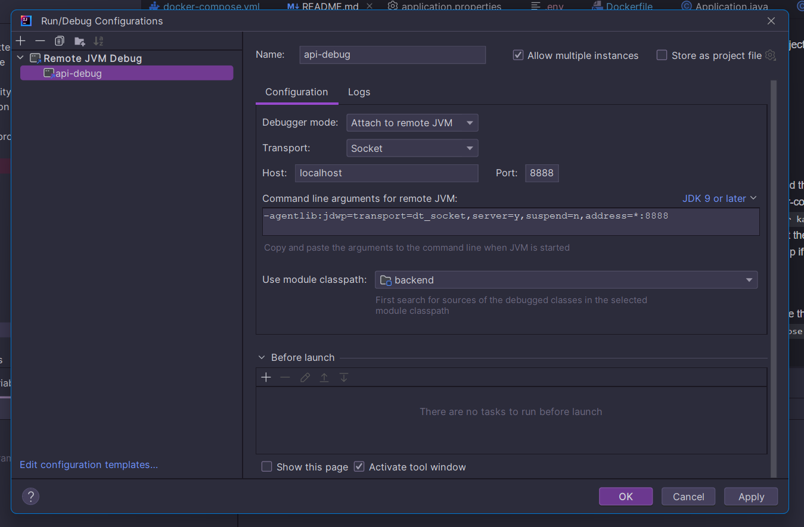

# _howtosavealife_
### Information system of a blood bank chain

Services:
- **api**: The core application
- **redis**: A key-value database, used in this project for caching
- **redis-insight**: Redis management GUI
- **db**: The main PostgreSQL database
- **pgadmin**: DBMS for PostgreSQL
- **kafka** & **zookeper**: Message broker
- **kafdrop**: Kafka GUI

To start, run these commands:
1. `./mvnw clean package -DskipTests` (to build the project .jar file)
2. `docker-compose build` (to build the docker-compose file)
3. `docker-compose up db pgadmin zookeeper kafka kafdrop redis redis-insight` (to run everything except the api)
4. Wait about a minute for the database to setup if running the project for the first time or after deleting the backend/postgres/data folder
5. New terminal, `docker-compose up api` (to run the api)

To stop any service, press CTRL+C.
To put services, run `docker-compose down -v`.
To run a service in detached mode (have it run in the background), add `-d` to the command (e.g. `docker-compose run db -d`).

In case of schema or data changes, delete the folder "data" inside the folder "postgres", (_backend/postgres/data_) and then run `docker-compose run db` again to rebuild the database with an updated schema.

After making any changes in the app, run the aforementioned steps again to rebuild the .jar and have docker run the updated version.

After starting the API through Docker, it is also possible to run the app in debug mode in IntelliJ. To do so, first add the following configuration:

You can then just press on the debug button and the application should start in debug mode.

To connect the database to pgAdmin, go to localhost:5050 and log in with the credentials provided in the .env file (_${EMAIL}, ${POSTGRES_PASSWORD}_).
Then, register a server with the hostname "db" and port "5432". The database name, as well as username and password are also written inside the .env file (_${POSTGRES_USERNAME}, ${POSTGRES_PASSWORD}, ${POSTGRES_DB}_).
